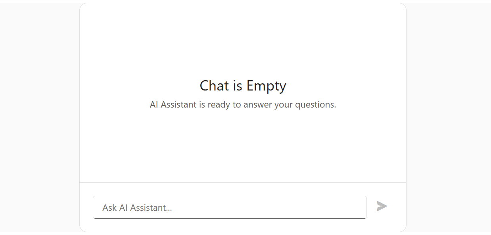

<!-- default badges list -->

<!-- default badges end -->
# DevExtreme Chat - Integration with OpenAI

This repository contains code referenced in the following DevExtreme help topic: [Integrate with AI Service - OpenAI](https://js.devexpress.com/Documentation/Guide/UI_Components/Chat/Integrate_with_AI_Service/#OpenAI).

This example integrates DevExtreme Chat with [OpenAI](https://platform.openai.com/docs/overview). Obtain your own [API key](https://platform.openai.com/api-keys) and replace the placeholder to integrate our implementation.

## Files to Review

- **jQuery**
    - [index.js](jQuery/src/index.js)
- **Angular**
    - [app.component.html](Angular/src/app/app.component.html)
    - [app.component.ts](Angular/src/app/app.component.ts)
- **Vue**
    - [ChatInterface.vue](Vue/src/components/ChatInterface.vue)
- **React**
    - [ChatApp.tsx](React/src/components/ChatApp.tsx)
- **NetCore**    
    - [Index.cshtml](ASP.NET%20Core/Views/Home/Index.cshtml)

## Documentation

- [Chat - Getting Started](https://js.devexpress.com/React/Documentation/Guide/UI_Components/Chat/Getting_Started_with_Chat/)
- [Integrate with AI Service - OpenAI](https://js.devexpress.com/Documentation/Guide/UI_Components/Chat/Integrate_with_AI_Service/#OpenAI)
- [Chat - API](https://js.devexpress.com/React/Documentation/ApiReference/UI_Components/dxChat/)

<!-- feedback -->
## Does this example address your development requirements/objectives?

 

(you will be redirected to DevExpress.com to submit your response)
<!-- feedback end -->
